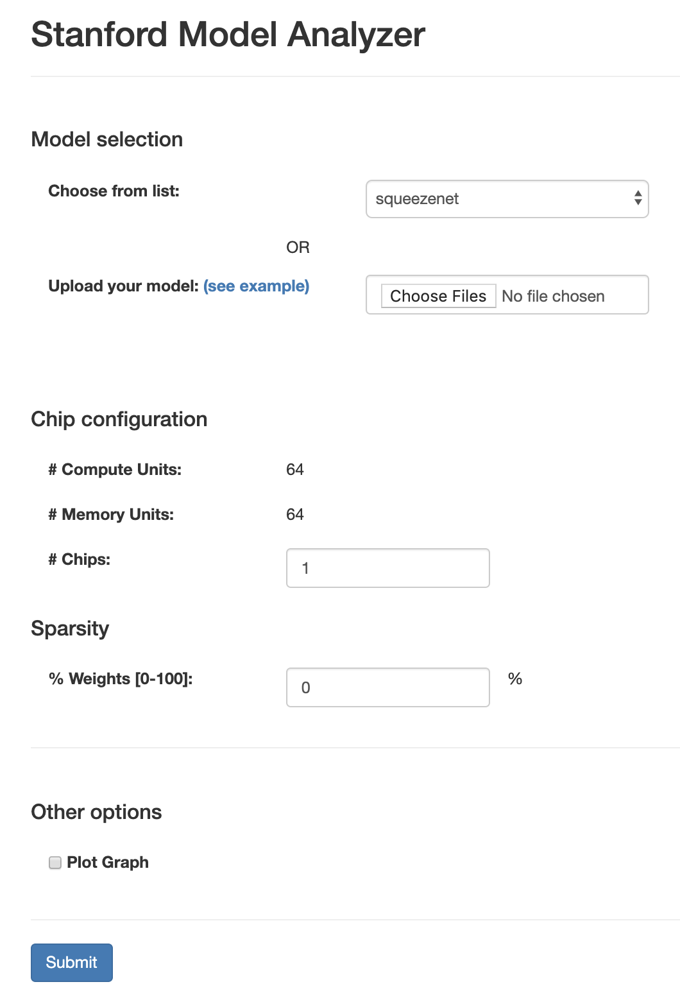

# The Stanford Plasticine Project

## CPU Spec
We ran our experiments on machines with 4 cores. Each core is an x86_64, Intel(R) Xeon(R) CPU E7-8890 v3 CPU. 64GB of memory should be enough for running all the experiments.

## FAQs
We document FAQs regarding simulation methods [here](FAQs.md).

## APIs
We extend existing libraries and enable applications written in these libraries to run on our accelerator platform, Plasticine.

To create an application using linear algebra or deep neural network libraries, please refer to the APIs of [PyTorch](https://pytorch.org/docs/stable/index.html). To create an application using graph libraries, please refer to the APIs of [NetworkX](https://networkx.github.io/documentation/networkx-1.10/index.html).

## Obtaining the Plasticine Image and Start the Container
First, you need to pull and run the docker image:
```bash
docker pull registry.sdh.cloud/2019-06-submissions/stanfordsdhph1/plasticine:latest
docker run -it registry.sdh.cloud/2019-06-submissions/stanfordsdhph1/plasticine:latest /bin/bash
```

## Running a Pre-built Graph Application Example

You can find the scripts for testing applications by running:
```bash
cd /sdh/scripts
ls
```

For example, if you want to run the script that implements random walk, simply run:
```bash
bash run_random_walk.sh
```

On the provided dataset, it will take a few minutes to run. After the run finishes, you will see the cycle and power report in:
```bash
/sdh/test_reports/
```

A report looks like:
```bash
Add mem entry: 0 5112 4
Add mem entry: 1 260512 204
Add mem entry: 2 5112 4
Add mem entry: 3 260512 204
Add mem entry: 4 1792 4
Add mem entry: 5 26824 60
Add mem entry: 6 1312 4
Add mem entry: 7 17008 52
Add mem entry: 8 1196 4
Add mem entry: 9 13116 44
Add mem entry: 10 1188 4
Add mem entry: 11 10660 36
Open zipped trace
== Loading device model file './ini/DRAM.ini' ==
== Loading system model file './ini/system.ini' ==
===== MemorySystem 0 =====
CH. 0 TOTAL_STORAGE : 4096MB | 1 Ranks | 16 Devices per rank
===== MemorySystem 1 =====
CH. 1 TOTAL_STORAGE : 4096MB | 1 Ranks | 16 Devices per rank
===== MemorySystem 2 =====
CH. 2 TOTAL_STORAGE : 4096MB | 1 Ranks | 16 Devices per rank
===== MemorySystem 3 =====
CH. 3 TOTAL_STORAGE : 4096MB | 1 Ranks | 16 Devices per rank
DRAMSim2 Clock Frequency =800000000Hz, CPU Clock Frequency=1000000000Hz
0...
1000000...
2000000...
3000000...
4000000...
5000000...
...
94000000...
95000000...
Simulation complete at cycle 95592587
Average Power: 48.161W
Application Runtime: 0.096s
```

The last three lines show:
```bash
Simulation complete at cycle 95592587
Average Power: 48.161W
Application Runtime: 0.096s
```
This means that the application takes 95592587 clock cycles to run on Plasticine. The average power of Plasticine when running this app is 48.161W. The wall clock time taken to run the app is 0.096 seconds.

## Developing a Graph Application and Estimating Its Performance
We support the [NetworkX](https://networkx.github.io/documentation/networkx-1.10/index.html) APIs. We assume that you would use Python as your main development language. To obtain the cycle and power number for your graph application, you need to add the following lines to your implementation:
```python
# Add the following imports
import gzip
import io
from stubbed.networkx_stubs import dumpmem, dumptrace, reset, stub

# We assume that you have a main function
if __name__ == "__main__":
  # Enable stubbing
  stub()

  # Leave the implementation of your graph application here
  ...

  # Dump the runtime trace to the disk
  with gzip.open("test_run.tsv.gz", "wt") as run:
    dumptrace(run)

  with open("test_mem.tsv", "w") as mem:
    dumpmem(mem)
```

Then, rerun your application. You will obtain two files, test_run.tsv.gz and test_mem.tsv. These two files contain traces for running the performance estimator. We assume that the absoluate paths to these two files are $TEST/test_run.tsv.gz and $TEST/test_mem.tsv

Next, go to the tungsten directory and run the estimator:
```bash
cd /sdh/tungsten
./tungsten $TEST/test_mem.tsv $TEST/test_run.tsv.gz
```

After the estimator finishes, it will report the number of cycles and power for running your application.

## Developing a Neural Network Application and Estimating Its Performance
We support the [PyTorch](https://pytorch.org/docs/stable/index.html) APIs. If you want to build an application based on deep neural networks or sparse linear algebra, please use the PyTorch library. Here are some tutorials on how to use PyTorch: [the offical PyTorch tutorials](https://pytorch.org/tutorials/).

To obtain the cycle and power number for a customized model, you need to upload a file that inherits nn.Module and implements a function called `get_model_info`. The model analyzer will treat this file as a Python module, and load the function. The template looks as follows:
```python
import torch
import torch.nn as nn
import torchvision

def get_model_info(batch_size = 1):
    """
    This function returns the necessary components to analyze a PyTorch model.

    Inputs:
    @batch_size:    The batch_size used to construct a dummy input

    Outputs:
    @model:         The PyTorch module, of type nn.module
    @dummy_inputs:  An example input to be fed to the model
    @loss_fn:       (Optional, can be None) A loss function to be applied to
    the output of model. If this is None, a naive loss function will be added.
    @loss_fn_args:  (Optional, can be None) Any additional arguments needed to
    execute loss function.

    The model analyzer will do:
        outs = model(*dummy_inputs)
        loss = loss_fn(outs, *loss_fn_args)
    """
    model = torchvision.models.resnet50()
    dummy_inputs = [torch.randn(batch_size, 3, 224, 224)]

    loss_fn = nn.CrossEntropyLoss()
    target = torch.LongTensor(batch_size).random_(10)
    loss_fn_args = (target, )

    return model, dummy_inputs, loss_fn, loss_fn_args
```

After reformatting your model, you will need to upload the model to a web-based [simulator](https://uflj73jfz.duckdns.org/). The web-based simulator is account protected.
Please use the following account name and password to sign in:
```bash
Username:
stanford829

Password:
7A%Q3+vK7#QuAFQS
```

Once you login to the web-based simulator, you will see an interface that looks like:



You can either choose a model, or upload your own model. Once you finish setting up your model, click submit. The simulator will report a simulation result that looks like:

```bash
**********Model Info Basic*********
Model name:	squeezenet
Mapping mode:	spatial
Number of nodes:	123 (original), 82 (after merging nodes)
Number of function nodes:	71 (original), 30 (after merging nodes)
Max depth:	54 (original), 21 (after merging nodes)

**********Inference Perf***********
Total flop of model:	701.0M (700981753)
Chip FLOPS utilization:	65.804%
Number of Compute Units used:	64
Throughput:	11.8K samples/s
Stage latency:	85.0us
Model latency:	1.8ms

**********Training Perf************
Total flop of model:	2.1G (2097762553)

WARNING: Configuration too small to map training on this model.

WARNING: Please try a larger number of chips.

**********Memory (summary)*********
Inference:	11.8M bytes, 125 Memory Units, (util: 37.691%)
Training:	49.9M bytes, 445 Memory Units, (util: 44.848%)

**********Power (summary)*********
Inference:	57.393 W
Training:	30.039 W

```

The inference performance can be found under:
```bash
**********Inference Perf***********
...
Throughput:	11.8K samples/s
...
Model latency:	1.8ms
```

This shows that the given model's latency is 1.8 ms, and the accelerator can generate 11.8K samples/s when running the model. You can find similar information regarding training under the training performance session in the report.

The power number can be found under:
```bash
**********Power (summary)*********
Inference:	57.393 W
Training:	30.039 W
```

This shows that the accelerator consumes 57.393W for running inference and 30.039W for running training.

## Developing a Sparse Linear Algebra Application and Estimating Its Performance
To build a sparse linear algebra application, please use the [torch.sparse](https://pytorch.org/docs/stable/sparse.html) library. Then, you can use the same template as provided in the last section to implement your sparse linear algebra application and submit it to the web simulator. On the simulator, you can adjust the sparsity of the weights. The simulator will generate results in the same format as discussed in the last section.